CUDA Image Filters
==================

**University of Pennsylvania, CIS 565: GPU Programming and Architecture, Project 4**

* Nischal K N
* Tested on: Windows 10, i7-2670QM @ 2.20GHz 8GB, GTX 540 2GB (Personal)

## SUMMARY
This Project implements the following image processing algorithms on CPU and GPU
* Tone Mapping: It is used to map one set of colors to another to approximate the appearance of high-dynamic-range images in a medium that has a more limited dynamic range. It is similar to the HDR mode of camera.
* Seam Carving for content aware resizing: It uses low energy seams to remove redundant pixels in each row/column to resize the image. This way the object of importance have a significant size even when resized.
* Red eye Reduction: It is a filter used to remove red pupils in color photographs of eyes when captured with a flash under low ambient light condition.
* Edge Preserving Blur: It is a noise-reducing smoothing filter for images while preserving edges.

A CPU and GPU implementation of the above 4 algorithms were evaluated for variation in performance of various stages of each filter. Also additional performance improvements are documented.

## BUILD INSTRUCTIONS
* Setup cuda development environment use [this guide](https://github.com/nischalkn/Project0-CUDA-Getting-Started/blob/master/INSTRUCTION.md#part-1-setting-up-your-development-environment)
* Download openCV 2.4.13 from [here](https://sourceforge.net/projects/opencvlibrary/files/opencv-win/)
* Set the environment variables as shown [here](http://opencv-srf.blogspot.com/2013/05/installing-configuring-opencv-with-vs.html)
* Create a new CUDA project and configure the project following from step 4 of **Configure Visual Studio Express** section in the above link.

## PARAMETERS
* `main.cpp` has 7 flags. Take care that only 1 of 4 image processing alogortihms is enabled at a time.
  * `PROFILE` - `1` or `0`, Print total execution times
  * `TONEMAPPING` - `1` or `0`, Enable/Disable tone mapping algorithm.
  * `SEAMCARVING` - `1` or `0`, Enable/Disable tone Seam carving algorithm.
  * `REDEYEREDUCTION` - `1` or `0`, Enable/Disable redeye reduction algorithm.
  * `BLUR` - `1` or `0`, Enable/Disable Edge preserving blur algorithm.
  * `CPU` - `1` or `0`, Enable/Disable algorithm running on CPU.
  * `GPU` - `1` or `0`, Enable/Disable algorithm running on GPU.
* `toneMapping.cu` has 2 flags
  * `PROFILE` - `1` or `0`, Print total execution times
  * `MINMAX_REDUCE` - `1` or `0`, select type of min max calculation
    * `1` - minmax using parallel reduction
    * `0` - minmax using atomic operations.
* `seamCarving.cu` has 2 flags
  * `PROFILE` - `1` or `0`, Print total execution times
  * `STREAMCOMPACTION` - `1` or `0`, select type of seam removal
    * `1` - seam removal by stream compaction
    * `0` - naïve seam removal by iterating

## Tone Mapping
Tone-mapping is a process that transforms the intensities in the image so that the brightest values aren't nearly so far away from the mean. That way when we transform the values into [0-255] we can actually see the entire image. It uses 3 steps to map the image. First is to Convert the image to Chrominance-Luminance(YUV) color space. Then we calculate the histogram and CDF of the Luminance channel. Finally we remap the intensity values. The following left image is the input image and the right image is the corresponding output image.

Input Image                |  Output Image
:-------------------------:|:-------------------------:
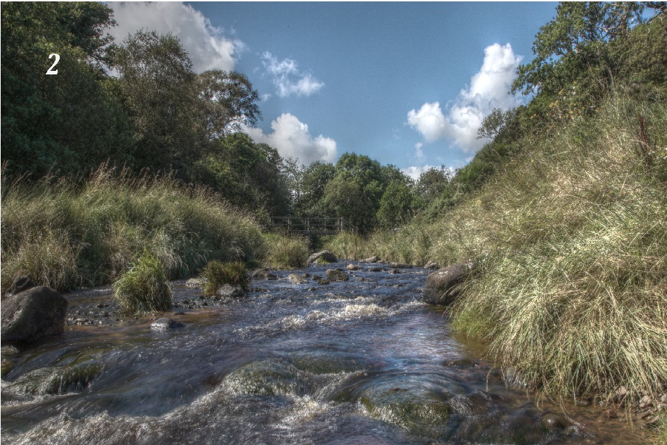      |  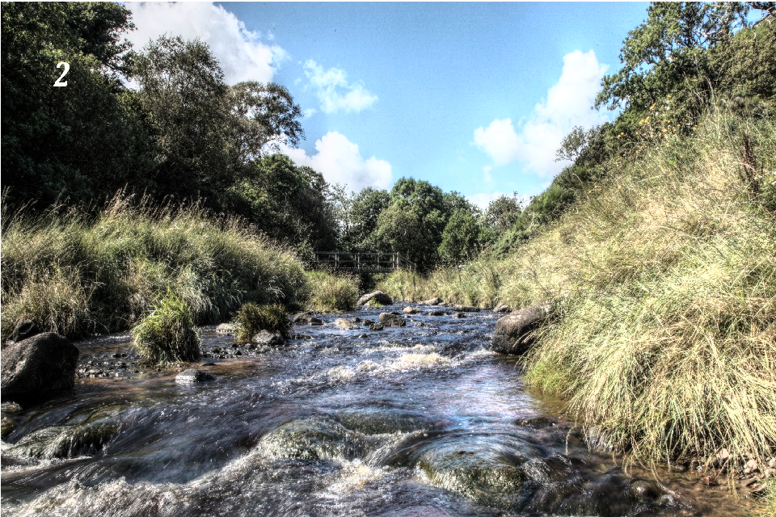

They GPU implementation of this algorithm uses 4 kernels
* Color space conversion kernel: rgb2xyY
* Histogram calculation kernel: histogram_kernel
* Normalized CDF calculation kernel: scan_kernel and normalized_cdf
* Final mapping kernel: tonemap

The performance of CPU and GPU implementation of tone mapping with different block sizes is shown in the figure below. It is seen that the GPU variants performs twice faster than the CPU implementation

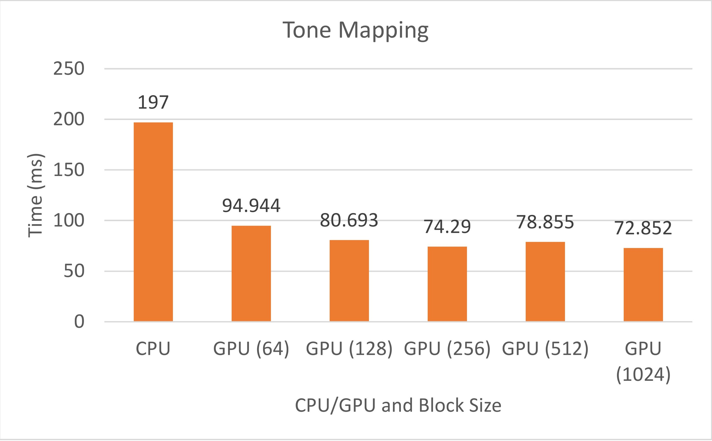

The average time taken by different stages of the algorithm is documented below. It is seen that all of the stages perform much better on the GPU. The tone mapping stage has the highest improvement.

Variation of different stages of the algorithm for different block sizes is shown in the image below. The kernel to find minimum and maximum of the array and the tone mapping kernel have a sharp improvement in performance with mid size kernel compared to small sizes. This is because each min/max calls involves multiple calls of the kernel which has a high overhead with small block sizes.

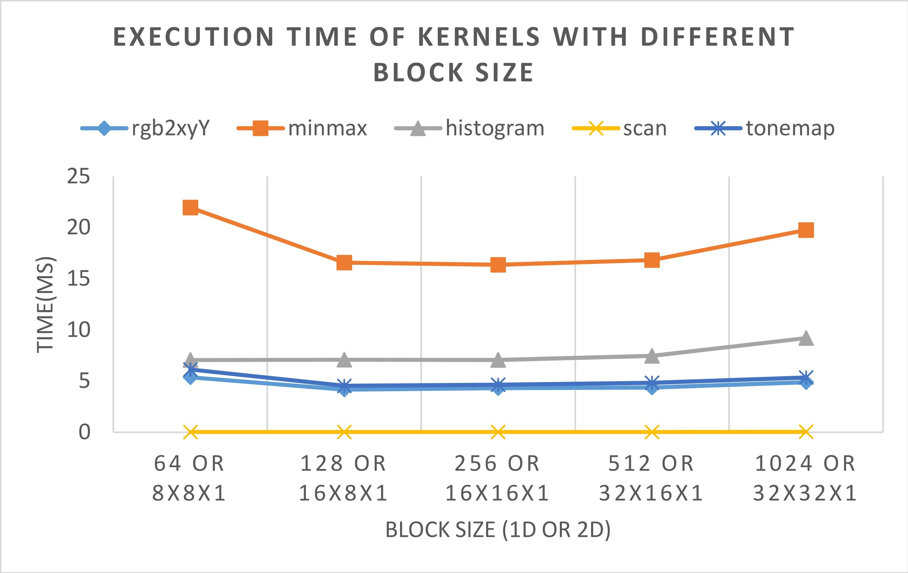

### Automic vs Reduce minmax
The following graph compares the performance of determining the minimum and maximum using atomic operations and by parallel reduction. An atomicCAS was used to find the maximum and minimum of the floating point array. It is seen that the parallel reduction method outperforms the atomic method. Further due to the sequential nature of operation of the atomic function, the time taken is invariant of the size of blocks.
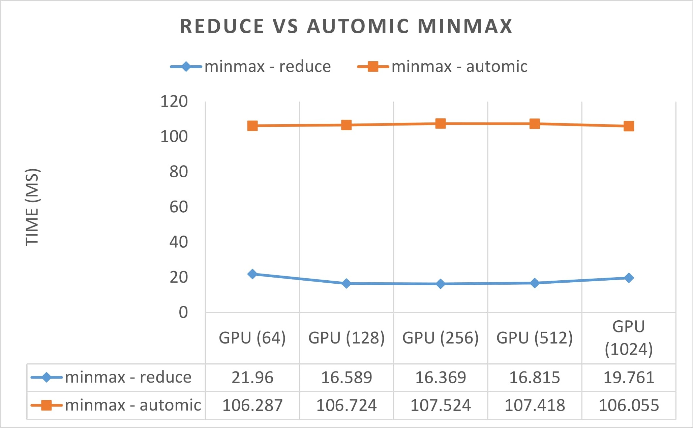

## Seam Carving
Seam carving is a process of finding a link of pixels from top to bottom or left to right such that it represents the minimum energy seam. By removing this seam we can resize the image without reducing the size of critical objects in the frame [[1](http://perso.crans.org/frenoy/matlab2012/seamcarving.pdf)].The purpose of the algorithm is image retargeting, which is the problem of displaying images without distortion on media of various sizes (cell phones, projection screens) using document standards, like HTML, that already support dynamic changes in page layout and text but not images.
In the following image, the left image is the input image, the center image resized naively by 100x100 pixels and the right most image is content aware resized by 100x100 pixels.

Input Image                |  Naive Resizing           |  Seam carving            
:-------------------------:|:-------------------------:|:------------------------:
      |  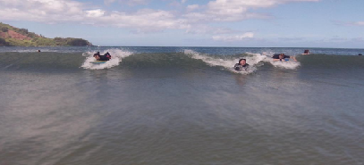  | 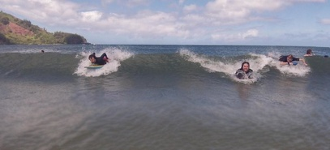  

It involves 3 stages, first stage is to generate the energy map of the image. Second is to calculate the minimum energy seam and finally to remove the pixels along the minimum energy seam.

The GPU implementation of this algorithm uses 3 kernels
* Energy distribution of the Image: computeEnergyGPU
* Find minimum energy seam
* Removing pixels along the seam using Stream Compaction

The performance of seam carving on CPU and GPU have been recorded and shown in the figure below. The GPU time also includes the time taken for memory transfer. It is seen that the GPU variant of the seam carving performs much slower than the CPU variant. This is explained in the next graph. Also the GPU performance is best when the block size is 256

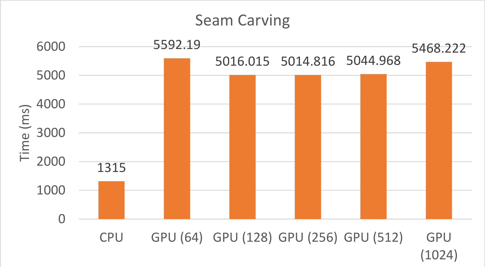

Only 2 kernels are used because the step of finding the minimum energy seam is a sequential process and hence there is no advantage of using the CPU. The stage of computing the energy is a data parallel process and hence and parallelized and hence its performance increases substantially. But however the process of removing the seam pixels is performed using stream compaction. Since a very few pixels are removed in each iteration it is an inefficient process and hence this stage uses a considerable amount of time.

Variation of different stages of the algorithm for different block sizes is shown in the image below. It is seen that the best performance is obtained with a block size of 128 or 256.

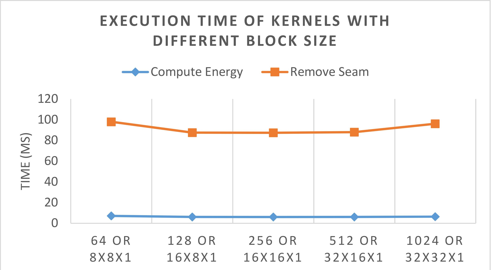

### Seam removal methods
Two different methods were experimented to remove the seam pixels from the image. First was the naïve method where the pixels were copied from old location to the new location and the second method used was stream compaction. The stream compaction uses work efficient scan. It is seen that the Stream Compaction performs marginally better than the naïve approach but still slower than the CPU implementation. This can be further improved by shared memory access.

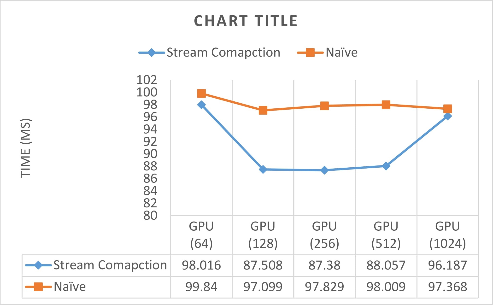

## Red Eye Reduction
Red eye reduction is an algorithm used to remove the effect of red pupil on images of faces taken under flash in low ambient light conditions. This is done by first finding the normalized cross correlation scores using the template of a red eye. Then the next step is to sort the pixels according to the decreasing order of the normalized scores and finally remapping the red channel of pixels with high correlation score to remove the red eye effect. The following image shows the image before and after red eye reduction filter

Input Image                |  Output Image
:-------------------------:|:-------------------------:
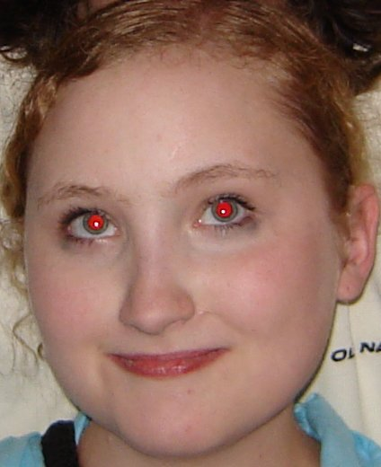      |  

The following are the 3 major kernels involved in the red eye reduction process
* Finding the normalized cross correlation scores
* Sorting the normalization scores
* Remapping of the red eye pixels

The performance of red eye reduction on CPU and GPU have been recorded and shown in figure below. It is seen that the performance improves 6 times on the GPU.

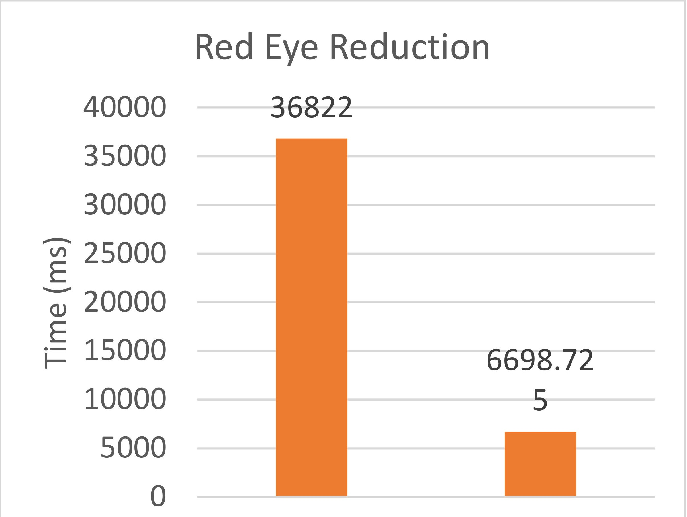

The time taken by various states is shown in the figure below. The most time consuming operation is the calculation of the cross correlation score. It is calculated using template matching which is data parallel, hence its performance improves drastically. On the other hand the performance of the sorting algorithm decreases on the GPU due to the large number of pixels resulting in a large number of blocks and multiple kernel launches. All the other kernels have an improvement in performance.

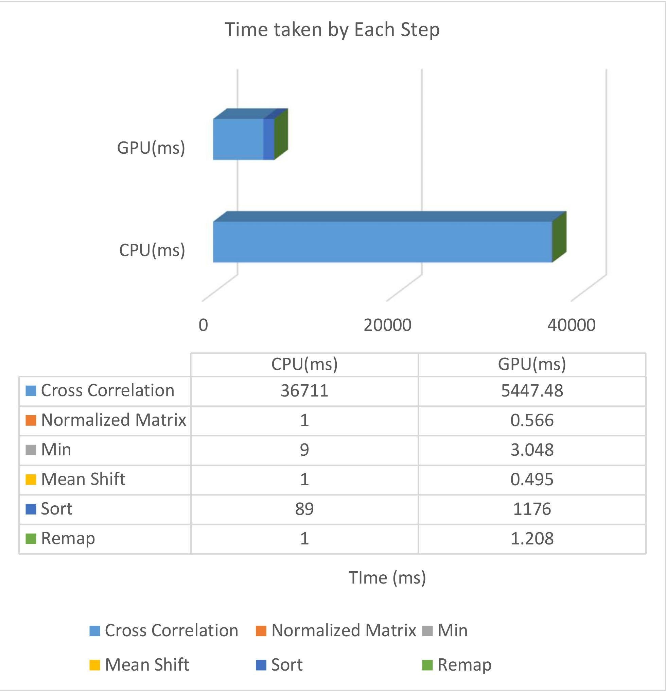

## Edge Preserving Blur
 In Edge preserving blur the intensity value at each pixel in an image is replaced by a weighted average of intensity values from nearby pixels. This weight can be based on a Gaussian distribution. Crucially, the weights depend not only on Euclidean distance of pixels, but also on the radiometric differences (e.g. range differences, such as color intensity, depth distance, etc.). This preserves sharp edges by systematically looping through each pixel and adjusting weights to the adjacent pixels accordingly.

Input Image                |  Output Image
:-------------------------:|:-------------------------:
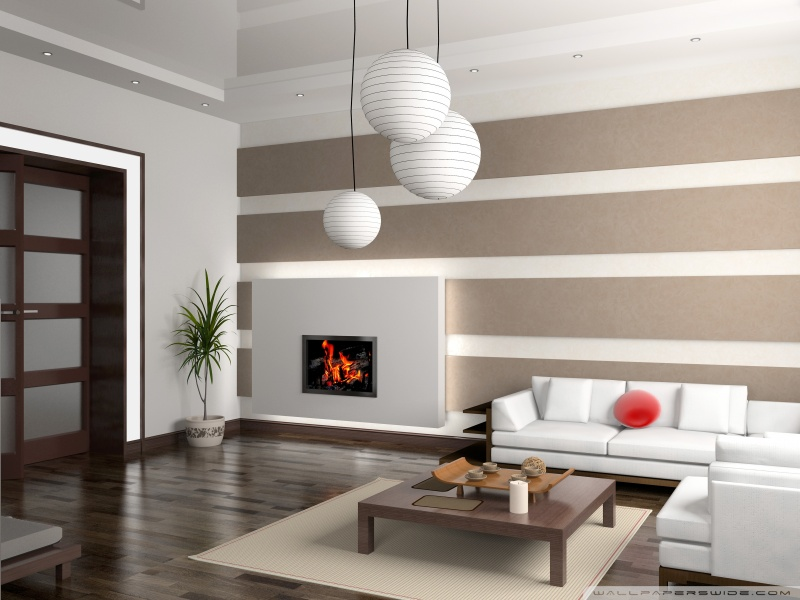      |  

The performance on CPU and GPU have been recorded and shown in figure below. It is seen that a kernel with 512 blocks has the best performance

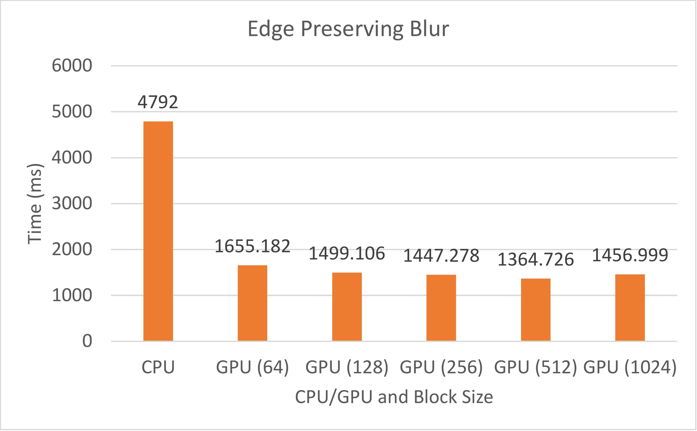
